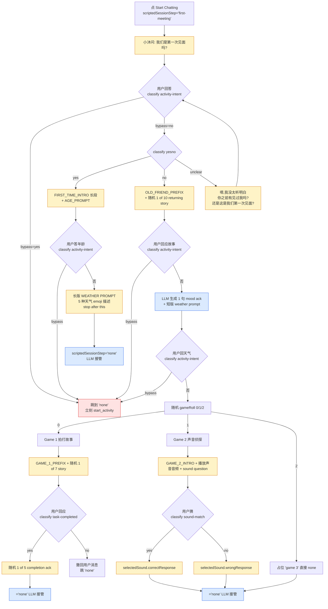
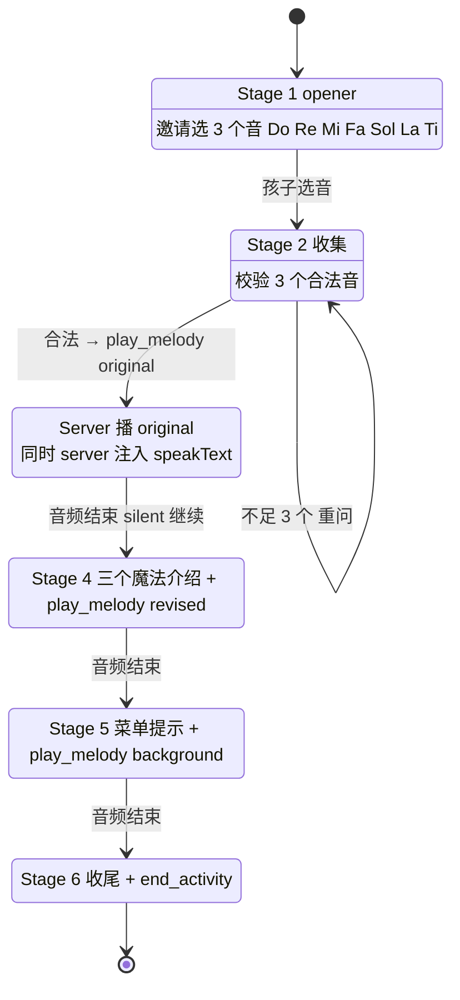

# Xiaomu 对话流 — 所有问句 / 所有可能回答 / Scripted vs LLM / 冲突清单

> 这份文档只关心 **小沐会说什么 / 孩子会怎么回答 / 谁来判定回答 / 哪些是写死的台词 / 哪些是 LLM 自己说的**。
> 不涉及服务器架构。
> 所有引文都是原文，附 `file:line` 出处。

---

## 0. 三个对话来源 — 必须分清

| 来源 | 标志 | 谁产生 | 何时产生 | 能否被用户编辑 |
|---|---|---|---|---|
| **A. Frontend 写死台词** | TestChat.tsx 里的 `const` 字符串 / config 里的 `conversationFlow` 字段 | 浏览器 zustand → 直接 push 到 transcript | scriptedSessionStep ≠ 'none' 时 | ✅ Studio Conversation Flow 面板 (但部分仍是代码常量兜底) |
| **B. LLM 流式输出** | 走 `/api/chat` SSE | gpt-5-chat (受 system prompt 约束) | scriptedSessionStep = 'none' 时；或活动 section 内 | ❌ 但 system prompt 可调 |
| **C. Server 注入 speakText** | tool result 里的 `speakText` 字段 | 服务器在 play_melody / end_activity 后塞 | 仅 co-creation stage 3/4/5/6 切换瞬间 | ❌ 写死在 coCreationAudio.ts |

> **核心规则**：A 永远跑在 B 之前。`dispatchScriptedOrBypass()` 在每个 scripted step 里调 `/api/classify { schema: 'activity-intent' }`，命中就立刻跳到 `'none'` 让 LLM 接管 (= **bypass**)。

---

## 1. 完整 scripted intro 对话树 (Frontend 主导)

入口：用户点 **Start Chatting** 按钮。

下方逐 step 列原文与所有可能回答。

---

### Step 1 · `first-meeting`

#### 小沐说什么
- **常量名**：`FIRST_MEETING_QUESTION`
- **出处**：`TestChat.tsx:79` + `introFlow.ts:11` + `seeds.ts:148` + `default.json:621`
- **原文**：
  > 我们是第一次见面吗?

#### 用户可能回答
| 回答类型 | 例子 | classifier (`yesno`) | 下一步 |
|---|---|---|---|
| 肯定 | "是" / "对" / "嗯" / "yes" / "第一次" / "没见过" | `yes` | → Step 2A `age` |
| 否定 | "不" / "不是" / "见过" / "no" / "我们认识" / "老朋友" | `no` | → Step 2B `returning-intro-answer` |
| 答非所问 | "我饿了" / "在哪里" / 表情符号 | `unclear` | → 重问 |
| **bypass: 直接说活动名** | "我想创作音乐" / "做呼吸" / "玩律动" / "let's make music" | `activity-intent=yes` (跑在 yesno 前面) | → 跳 `'none'`，立即 `start_activity` |

#### 重问句 (unclear 分支)
- **常量名**：`RE_ASK_FIRST_MEETING`
- **出处**：`TestChat.tsx:1307` + `introFlow.ts:50` + 也内联在 system prompt `assembleSystemPrompt.ts:187`
- **原文**：
  > 嗯,我没太听明白。你之前有见过我吗?还是这是我们第一次见面?

> ⚠️ **冲突点 1（详见 §6）**：system prompt 里同时存在 "你 (LLM) 自己判断 yes/no 然后分支" 的指令，但实际上 frontend 已经先调 classifier 路由完了。LLM 永远不会接到第一句的判断权。

---

### Step 2A · `age` (走 yes 分支)

#### 小沐说什么
两段 push 在同一条 assistant 消息里：

**(a) FIRST_TIME_INTRO** — `TestChat.tsx:81-89` / `seeds.ts:150-158` / `default.json:622` / 同时内联在 system prompt `assembleSystemPrompt.ts:220-221`
> 嗨！我来自彩虹缤纷镇，一个五彩缤纷的小地方。那里每座房子都有自己的歌，我们都相信，歌声里住着真正的自己。
>
> 有一天，我许了个愿：去小镇外面，认识新朋友。也许他们的心里，也藏着一首歌。
>
> 我相信：
> 轻轻哼一哼，能让心里乱乱的感觉安静下来。
> 稳稳的节拍，能让勇敢的种子发芽。
> 一首简单的歌，能让人不再孤单。
>
> 所以我翻山越岭来找你。我想和你一起唱歌，陪你找到你的音乐，分享你的心情，创作可爱的小歌。
>
> 你的心里藏着一首歌。我好想听一听呀。

**(b) AGE_PROMPT** — `TestChat.tsx:91` / `seeds.ts:160` / `default.json:623`
> 你今年几岁呀？

#### 用户可能回答
| 回答类型 | 例子 | classifier | 下一步 |
|---|---|---|---|
| 报数字 | "7" / "我七岁" / "I'm 8" / "8 years old" | (不分类，直接落地) | 推 WEATHER_LONG → `'none'` |
| 拒绝/糊弄 | "我不告诉你" / "猜猜" / "不知道" | (不验证) | 同上 推 weather |
| **bypass** | "我想做呼吸" / "可以播音乐吗" | `activity-intent=yes` | 跳 `'none'` 立即 `start_activity` |

> ⚠️ **frontend 不做年龄合法性校验**：哪怕用户说 "100 岁" / "不告诉你" / "🐶"，仍然继续推 weather。年龄字符串只作为下一条 user msg 的内容塞进历史给 LLM 参考。
> ⚠️ **persona.ageYears 与用户口报年龄不一致**：assembleSystemPrompt 用的是 `persona.ageYears` (Studio 端配的)，而不是孩子嘴里说的。如果家长选了 "Yuhan (12 岁)" 的 persona 但孩子说 "我 5 岁"，所有 ageRouting / 活动 ageBucket 仍按 12 岁走。

#### Step 2A 的最后一句：WEATHER PROMPT (长版)
- **常量名**：`WEATHER_PROMPT`
- **出处**：`seeds.ts:165-177` / `default.json:627` / system prompt `assembleSystemPrompt.ts:228-230`
- **原文**：
  > 在我的家乡，我们喜欢用天气来形容我们的心情。
  > ☀️ 晴天 太阳暖暖的，心里也亮亮的，想笑，想跑，想出去玩。
  > ☁️ 阴天 天灰灰的，心里也灰灰的，不想说话，也没力气玩。
  > ☔ 下雨天 雨滴滴答答，心里湿湿的、闷闷的，像衣服淋了雨没换。
  > ⚡ 雷雨天 打雷了，心怦怦跳，有点怕，想躲进被子里。
  > ❄️ 下雪天 雪花轻轻飘，心里静静的、软软的、像盖了一条软毯子。
  > 你觉得哪个天气可以代表你的心情啊？

**说完直接 `setScriptedSessionStep('none')`**，剩下交给 LLM。**Frontend 不再问后续问题，包括不再 offer 热身游戏。**

> ⚠️ **冲突点 2**：system prompt §opening 里 yes 分支写的是 "weather prompt 后 STOP，等孩子答天气" — frontend 完全照做了。但 system prompt §opening 的 no 分支里说 "返回老朋友 → 接 activity decision (含热身游戏 offer)"，而 frontend no 分支走的是另一条路 (Step 2B 走完接 Step 3 weather game choice 抛随机 game)。两边的 "no 分支" 行为根本不一致。

---

### Step 2B · `returning-intro-answer` (走 no 分支)

#### 小沐说什么 (两段拼在一条 assistant 消息)

**(a) OLD_FRIEND_PREFIX** — `TestChat.tsx:53` / `seeds.ts:163` / `default.json` `conversationFlow.oldFriendIntroPrefix`
> 原来我们是老朋友啊，那我给你分享一下我今天的故事。

**(b) 随机 1 of 10 returning story** — `seeds.ts:179-189` / `default.json:628-639`
1. 今天我在彩虹缤纷镇的草地上躺了好久，看云慢慢飘。有一朵云的样子像小兔子，我对它招手，它就轻轻飘走了。
2. 今天小镇的钟楼出了点问题，钟声响了又响，所有人都笑着捂耳朵。后来大家一起把钟声变成了一段小小的合唱。
3. 今天有一只小松鼠把它的橡果藏进了我的口袋。我把橡果还给它的时候，它跳到我的肩膀上轻轻碰了碰我的耳朵。
4. 今天彩虹缤纷镇下了好软的雨，每一滴落到地上都会发出叮当一声。我和朋友们打着伞，跟着雨声踩出了一段节拍。
5. 今天我学了一种新的歌，叫做"夜晚的呼吸"。唱的时候要慢慢的，像夜里的风。
6. 今天我去面包房闻刚出炉的香气，面包师傅给了我一个心形的小面包。我把它分成了好多块，带回来给镇上的小朋友。
7. 今天有一只小蝴蝶停在我手上好久好久。我都不敢动，怕惊到它。它停够了才慢慢飞走，飞的时候像在跟我说再见。
8. 今天我和好朋友们去河边玩，我们把小石子排成一条彩虹的形状。河水流过去，石子还稳稳的，没被冲走。
9. 今天彩虹缤纷镇的灯笼节开始了。每盏灯笼里都装着一句小小的愿望。我也写了一个，挂得高高的。
10. 今天我学会了一首关于星星的小歌。唱起来很轻很轻，像是怕把星星吓跑一样。

#### 用户可能回答
| 回答类型 | 例子 | classifier | 下一步 |
|---|---|---|---|
| 任意回应 | "好玩" / "嗯" / "你的故事好听" / "我也想跟你玩" | `activity-intent=no` | → Step 3 `weather-game-choice` |
| **bypass** | "我想创作音乐" | `activity-intent=yes` | 跳 `'none'` 立即 `start_activity` |

#### 然后 frontend 推 mood ack + 短 weather (TestChat.tsx:1380)
- **mood ack 这一句是 LLM 生成的**，不是写死。是 frontend 调一次 `/api/chat` 拿 1 句回复。这是 **LLM 嵌在 scripted 流里**。
- 接着拼上 **SHORT_WEATHER_PROMPT** — `TestChat.tsx:93` / `seeds.ts:162` / `default.json:625`
  > 你觉得哪个天气可以代表你的心情啊？

#### 然后等用户回天气，进入 Step 3

---

### Step 3 · `weather-game-choice` (仅 no 分支会到)

#### 小沐说什么
**取决于 `gameRoll = Math.random() * 3`**：

##### gameRoll = 0 → Game 1 拍打故事 (rhythm-story)

**(a) GAME_1_PREFIX** — `TestChat.tsx:95` / `seeds.ts:439` / `default.json:401`
> 今天啊，在玩游戏之前，我们先来玩一个小活动。我先给你讲一个小故事。

**(b) 随机 1 of 7 故事** — `TestChat.tsx:97-105` / `seeds.ts:440-447` / `default.json:402-409`
每个故事末尾都是固定的："拍完后，请告诉我我拍完啦。"

完整故事文本 (节选格式)：
1. 有一只小猫……它今天有点不开心。我们一起拍一拍肚子，让它感觉温暖一点，好吗？请你用手拍三下肚子，慢慢的、轻轻的。拍完后，请告诉我"我拍完啦"。
2. 有一只小兔子……它跳啊跳，越跳越快。我们陪它跳一段，好不好？请你用手拍六下大腿，越拍越快。拍完后，请告诉我"我拍完啦"。
3. 有一只小熊……它在森林里走得有点累了。我们一起帮它拍出走路的节奏，好不好？请你用手拍四下大腿，稳稳的、慢慢的。拍完后，请告诉我"我拍完啦"。
4. 有一只小鸟……它在树枝上唱歌。我们一起给它打节拍，好不好？请你用手拍五下手掌，轻轻的、有弹性的。拍完后，请告诉我"我拍完啦"。
5. 有一只小狗……它在追自己的尾巴，开心得不得了。我们陪它一起跳，好不好？请你用手拍七下肚子，快快的、跳跳的。拍完后，请告诉我"我拍完啦"。
6. 有一头小象……它走得稳稳的、慢慢的。我们一起给它打节拍，好不好？请你用脚轻轻踏三下，深深的、稳稳的。拍完后，请告诉我"我拍完啦"。
7. 有一只小鱼……它在水里游来游去，尾巴一摆一摆。我们一起给它打节拍，好不好？请你用手轻轻拍五下桌子，柔柔的、滑滑的。拍完后，请告诉我"我拍完啦"。

→ 进 Step 4A `game-1-completion`

---

##### gameRoll = 1 → Game 2 声音侦探 (sound-detective)

按顺序 push 3 条 assistant 消息：

**(a) GAME_2_INTRO** — `TestChat.tsx:115-122` / `default.json:423`
> 在开始体现其他活动之前，我有一个我们可以玩的小游戏哦
>
> 今天，我们要变成声音侦探...

**(b) 播放声音音频** (audio asset, 不是文字)

**(c) sound question** — 5 种声音之一 (随机)。例子: 鸡叫
> 仔细听……
>
> 你觉得是什么东西发出的声音？

5 种声音全集 (`TestChat.tsx:143-224` / `default.json:424-517`)：
| label | question | 期望答案 |
|---|---|---|
| 鸡 Chicken | 仔细听……你觉得是什么东西发出的声音？ | 鸡 / 母鸡 / chicken |
| 风 Wind | 仔细听……你听到了什么？是什么在动？ | 风 / wind |
| 雨 Rain | 仔细听……听起来像什么从天上落下来？ | 雨 / 下雨 / rain |
| 狗 Dog | 仔细听……是什么小动物在叫呢？ | 狗 / 小狗 / dog |
| 鸟 Bird | 仔细听……是谁在树上唱歌？ | 鸟 / 小鸟 / bird |

→ 进 Step 4B `game-2-answer`

---

##### gameRoll = 2 → 占位 (TestChat.tsx:1454)
直接 push 字符串 `"game 3"` (开发占位)，立即 `setScriptedSessionStep('none')`。

> ⚠️ **冲突点 3**：这是裸字符串占位，没有任何意义。如果生产环境抽到 gameRoll=2，孩子会看到字面 "game 3"。**Bug。**

---

### Step 4A · `game-1-completion`

#### 等待 trigger
不主动推问句。等下一条用户消息，调 `classify task-completed`。

#### 用户可能回答
| 回答类型 | 例子 | classifier (`task-completed`) | 下一步 |
|---|---|---|---|
| 完成 | "我拍完啦" / "拍完了" / "done" / "好了" / "ok 我弄完了" | `yes` | 推完成回复 → `'none'` |
| 还在做 / 拒绝 | "还没有" / "我不会" / "再来一次" / "太难了" | `no` | 撤回用户消息，跳 `'none'`，由 LLM 接管 |
| **bypass** | "我想创作音乐" | `activity-intent=yes` | 跳 `'none'` start_activity |

#### 完成回复 (随机 1 of 5)
`TestChat.tsx:107-113` / `seeds.ts:449-455` / `default.json:411-416`
1. 你拍的时候好认真。我听着听着，好像真的感觉到你心里有一个声音——它在跟我说话呢。
2. 你拍出来的节奏，我听到啦。每一下都像是从你心里冒出来的小光。
3. 哇，你的节拍稳稳的，我感觉到了你的力气。
4. 我刚刚一直在跟着你的节拍点头。你拍得真好听。
5. 谢谢你陪我完成这个节奏。你的手现在是不是有点暖暖的？

> ⚠️ **frontend 没限制重试次数**：用户连说 10 次 "还没有"，frontend 会 10 次 rollback 然后跳 'none'。

---

### Step 4B · `game-2-answer`

#### 等待 trigger
等用户回答声音是什么，调 `classify sound-match` (带 `context: selectedSound.label`)。

#### 用户可能回答
| 回答类型 | 例子 (期望"鸡") | classifier (`sound-match`) | 下一步 |
|---|---|---|---|
| 猜对 | "鸡" / "小鸡" / "母鸡" / "chicken" | `yes` (sound-match 设计为宽松) | 推 correctResponse → `'none'` |
| 猜错 | "猫" / "玩具" / "我不知道" / "🐶" | `no` | 推 wrongResponse → `'none'` |
| **bypass** | "我想创作音乐" | `activity-intent=yes` | 跳 `'none'` |

#### 完整 correct / wrong 文本 (鸡的例子)
- **correct**：
  > 答对啦！听得好准！
  >
  > 那是鸡。
  >
  > 鸡在走来走去、找食物、或者跟其他鸡说话的时候，常常会发出"咯咯咯"的声音。
  >
  > 你的耳朵像侦探一样灵！
- **wrong**：
  > 你猜得也很认真哦！
  >
  > 答案是鸡。
  >
  > 你有没有听到那种短短的"咯咯"声？很多鸡在农场里走动的时候，会发出这种快快的、一跳一跳的声音。
  >
  > 你听得很仔细呢。

5 种声音都有自己的 correctResponse / wrongResponse，模式相同。

> ⚠️ **关键宽松**：sound-match 的 instruction (`classify.ts:65-74`) 写明 "Be lenient — related words, partial matches, child-appropriate descriptions, and any animal/object family member count as YES"。所以孩子说 "鸟" 当期望是 "鸡" 时，可能会被误判为 yes。

---

### Step 5 · `'none'` — LLM 接管

进 'none' 后所有问句都由 LLM 自己产生，受 system prompt 约束。**Frontend 不再 push 任何 scripted 文本**，除了：
- 用户消息命中 `distressKeywords` → 走 §4 distress 短路
- 用户表达活动意图 → LLM 调 `start_activity` tool → 进 §2 活动内对话
- 会话结束 → 走 §3.5 closing

---

## 2. 活动内对话 (Frontend + LLM + Server 三方都说话)

### 2.1 `breathing` (scripted, age-bucketed)

#### Start activity
1. LLM 调 `start_activity({ activity_id: 'breathing' })`
2. 服务器 `resolveStartActivity` 按 `persona.ageYears` 匹配 ageBuckets → 返回 `currentSectionText` (= 第 1 段 narrationScript)
3. LLM 收到 system prompt 强制指令 "你的回答必须从 section text 第一个字符开始，不许加 preamble"
4. LLM 流式逐字输出该 section
5. 浏览器同时播 ageBucket.audioFilenames 里的呼吸音乐 (循环)

#### narrationScript (3-7 岁 bucket) — `default.json:248`
> 嗨~我们一起来玩一个安静的小游戏，叫做"小气球深呼吸"，好不好？把背靠好，舒舒服服的。手轻轻放在肚子上。准备好了吗？
>
> 好~跟着我一起。我们慢慢用鼻子吸一口气……一……二……三……四……感觉到肚子鼓起来了吗？就像一个小气球慢慢变大。
>
> 现在，轻轻地从嘴里把气吹出来……一……二……三……四……五……六……让气球慢慢变小。做得真好。
>
> 再来一次。慢慢吸气，一、二、三、四……（停一停）然后慢慢呼气，一、二、三、四、五、六……
>
> 最后一次。这次我们一起想象——吸气的时候，把今天所有担心都装到肚子里；呼气的时候，让担心一起飘出去，飘到天上去。深深地吸……（停）轻轻地呼……
>
> 做完啦~小朋友，你现在感觉怎么样？是不是身体软软的、心里也安静了一点点？

#### 用户可能回答 (在 section 之间)
| 回答 | classifier | 行为 |
|---|---|---|
| "继续" / "嗯" / "好" | (无) | sectionIndex++，LLM 流下一段 |
| "我不想做了" / "停" | `quit-activity=yes` | 触发 `end_activity` |
| "怎么做" / "听不懂" | (无 classifier) | LLM 自由回应澄清，仍在活动内 |
| **直接说别的活动名** | `activity-intent=yes` | 触发 `end_activity` + 新 `start_activity` |
| 最后回答 "感觉好多了" | (无) | LLM 自由收尾或调 `end_activity` |

> ⚠️ **冲突点 4**：breathing 只有 1 个 ageBucket (`min:0, max:7`)。如果 persona 是 12 岁的 Yuhan，匹配会失败，`resolveStartActivity` 返回 fail，整个 chat 流程报错。**Bug**：没有 fallback bucket。

---

### 2.2 `body-rhythm` (scripted, age-bucketed)

类似 breathing。2 个 ageBucket (0-7 / 8-12)。narrationScript 是关于"拍手回声游戏、动物动作、节奏小火车"的长段文本。

可能问到的小问题嵌在 narrationScript 里 (例如 "你想做哪只动物？") — **这些不是 frontend 写死的问句**，是脚本文本里 inline 的。**LLM 必须照念，不能改**。

#### 风险
- 孩子的回答会被丢给 LLM 自由处理，没有 classifier。LLM 可能"超出脚本即兴回复"。
- 但 system prompt 又严令 "stop after section"，所以 LLM 通常会在该段结束就停。

---

### 2.3 `emotion-music-mapping` (scripted, emotion-bucketed)

`resolveStartActivity` 按 `args.emotion` 匹配 7 个 emotionBucket：calm / happy / sad / angry / scared / excited / surprised。

每个 emotion 一段 narration (~3-5 句)。例子 (calm)：
> 平静可以用轻柔的钢琴和温柔的铃声来表现。慢慢的旋律和舒服的节奏，会带来一种安静的感觉，就像飘在云朵上，或者躺在暖暖的毯子下休息。

#### 触发 emotion 的问题
**LLM 调 `start_activity` 时必须传 `emotion` 参数。** LLM 怎么决定 emotion？依靠：
1. 孩子先表达的情绪 (前面对话里说 "我难过" 之类)
2. 或 LLM 主动问 "你现在心情是什么样的？"

> ⚠️ **冲突点 5**：system prompt §opening 明确禁止 "mood metaphor deflection"（不许问 "你心情是哪种颜色 / 天气 / 动物"），但 emotion-music-mapping 活动本身就需要 emotion 输入。结果：LLM 容易在活动启动前夹一句 "你现在感觉怎么样？" — 这一句**是 LLM 自由生成的**，不是 scripted。
> 解决空间：在 system prompt 加 "如果孩子还没说情绪，直接调 start_activity 时省略 emotion 参数" 或者 "默认 calm"。

---

### 2.4 `co-creation` (interactive, 6 stage 状态机)

**最复杂的活动**。台词来源混合：
- **Stage 1 opener**：服务器 `resolveStartActivity` 返回 `currentSectionText` 给 LLM 照念
- **Stage 2 / 4 / 5 / 6**：system prompt 强制 LLM 自己念 verbatim
- **服务器中段强插 speakText**：当 LLM 调 `play_melody` / `end_activity` 时

#### Stage 流转

#### 每个 Stage 的台词

**Stage 1 opener** (server 返回的 `currentSectionText`)
> [由 `default.json` co-creation activity 的 narrationScript 第 1 段决定，verbatim 强制]

**Stage 2 (LLM 说的)** — system prompt `assembleSystemPrompt.ts:334` 强制
> 选得真好！我们来听听你的音乐听起来是什么样子的。
(随后 LLM 同回合调 `play_melody({ notes, variant: 'original' })`)

**Stage 2 重问 (不足 3 个音)** — system prompt `assembleSystemPrompt.ts:335`
> [重列 Do Re Mi Fa Sol La Ti 6 个选项, 让孩子重选]

**Stage 4 三个魔法** — system prompt `assembleSystemPrompt.ts:341` 强制完整复述
> 哇！我们一起创造了一个音乐点子！🎉 但是音乐家们常常喜欢跟自己的音乐玩游戏，用不同的方式去改变它。我们来学几个音乐魔法吧！🦋 魔法一：换一个音符 — 换掉其中一个音符，听听看音乐会变得不一样。🐢🐇 魔法二：改变速度 — 速度就是音乐的快慢。⭐ 魔法三：加入一个新音符。现在，我们来听一听，这段音乐可以变出什么不一样的样子吧。
(同回合调 `play_melody({ notes: 原音, variant: 'revised' })`)

**Stage 5 菜单** — system prompt `assembleSystemPrompt.ts:348` 强制
> 现在轮到你当音乐探险家啦！1️⃣ 换一个音符  2️⃣ 改变速度  3️⃣ 加入一个新音符。慢慢来，没有标准答案。我好期待听到你创作的音乐！🌈
(同回合调 `play_melody({ notes, variant: 'background' })`)

**Stage 6 收尾** — system prompt `assembleSystemPrompt.ts:355` 强制
> 谢谢你今天和我一起创作音乐。🎵 你的音乐跟别人的不一样，因为它来自你心里。我会记住我们的音乐大冒险，下次我们可以一起创作新的东西！下次再来彩虹缤纷镇找我玩哦！🌈✨
(同回合调 `end_activity()`)

#### 用户在每个 Stage 可能怎么回答
| Stage | 期待回答 | 偏离回答处理 |
|---|---|---|
| S1 → S2 | 三个音名 ("Do Re Mi") / 数字 (1 2 3) / 混合 | 不足 3 个 → 重问；多于 3 → 取前 3；非法名 → 重问 |
| S3 等音频 | (静默) "继续" 自动触发 | "再放一次" — LLM 无脚本处理，可能即兴回应 |
| S4 → S5 | 任何 ack | quit-activity=yes → end |
| S5 → S6 | "我要换音符" / "1" / "魔法一" 等 | LLM 无 stage 内分支，靠 system prompt 硬绑下一 stage |
| S6 | 任何 | end_activity 已调，回到正常 LLM |

> ⚠️ **冲突点 6**：Stage 5 菜单给孩子 3 个选项 (换音符 / 改速度 / 加新音符)，但**没有为这 3 个选项分别设计后续音频**。`play_melody({ variant: 'background' })` 已经在 Stage 5 同回合播了，所以孩子选什么其实**不影响**接下来播什么音乐。**这是个交互假象 / dialogue bug**。要么删掉菜单要么真的实现 3 个分支。

> ⚠️ **冲突点 7**：Stage 转换靠 `coCreationLastVariant` 状态从历史消息推断。如果消息历史被压缩 / 截断 / LLM 改写了关键标记词，推断会失败，结果是 stage 跳错或卡死。

---

## 3. LLM 自由发挥的对话区域

### 3.1 进入 `'none'` 后的所有自由对话
**所有问句都由 LLM 即兴产生**，受 system prompt 约束：
- 必须用 ageRouting 决定的语言复杂度
- 必须避开 safety.avoidTopics 和 hardProhibitions
- 优先建议 ageRouting 里 `preferredActivities` 中的活动
- 一旦孩子表达活动意图就立刻 `start_activity`
- 最多 1 次开放式情绪 check-in
- 禁止 mood metaphor deflection (颜色 / 天气 / 动物比喻)

LLM 可能问的常见问句类型 (非 scripted)：
- "你想做什么呢？"
- "你今天心情怎么样？" (允许 1 次)
- "我们要不要做个呼吸练习？"
- "需要我陪你聊一聊吗？"
- 关于 persona 的事 (likes / dislikes 提到的话题)

> ⚠️ **冲突点 8**：system prompt 明确说 "最多 1 次开放式 check-in"，但 LLM 仍可能不遵守。**没有 frontend 计数器强制**。

---

### 3.2 transition phrases (LLM 用于活动之间过渡)
3 选 1，全部 LLM 自由调用 (system prompt `assembleSystemPrompt.ts:420`)
1. 嗯……我们换一个试试？
2. 你想不想尝试一个新的小有些？  ← **typo: "小有些"，应是 "小游戏"**
3. 要不要我们先歇一歇？

> ⚠️ **冲突点 9**：typo "小有些" 直接传给 LLM 当模板，LLM 大概率会原样念出来。**Bug**。

---

### 3.3 break suggestion (4 选 1, LLM 在 maxTurnsBeforeBreak 后建议)
`default.json:640-644`
1. 我们要不要先休息一下，聊聊别的？
2. 听听你的呼吸，要不要停一停？
3. 我们玩了好一会儿了，要不要让脑袋放松一下？
4. 你累不累呀？想不想换个安静的活动？

> ⚠️ `maxTurnsBeforeBreak` 由 LLM 自己数 turn (system prompt 提示了次数)。**没有 frontend 强制触发**。LLM 经常忘记数。

---

### 3.4 session opening (LLM 在 session 开头可能说)
`default.json:613`
> 欸，你来啦！今天我们要做什么呢？

> ⚠️ **冲突点 10**：这一句和 FIRST_MEETING_QUESTION ("我们是第一次见面吗?") 冲突。Frontend 先 push first-meeting，LLM 永远轮不到说 opening。这句 opening 是 dead code。**建议删除或改成只在已知 returning 的场景用**。

---

### 3.5 session closing (4 选 1, LLM 主动决定何时收尾)
`default.json:614`，用 `/` 分隔的 4 个选项
1. 今天谢谢你陪我。好好休息，我们下次见
2. 今天谢谢你啦，我要参加音乐排练了，我们下次见！
3. 你今天真的好厉害，我要去做音乐小蛋糕了，拜拜！
4. 今天谢谢你啦，我有点困，想睡觉了，拜拜！

> ⚠️ 没有 frontend 端的 goodbye classifier 触发。靠 LLM 自己判断。

---

## 4. Safety / Distress — 永远短路

### 4.1 Frontend 本地关键词拦截
每条 user msg 先做子串扫描 (`safety.distressKeywords`, `default.json:684-710` 共 25+ 关键词)：
- 我不想活了
- 想死
- 自杀
- 不想活
- 活着没意思
- 想结束这一切
- 想消失
- 想跳楼
- ... (完整列表见 default.json)

**命中后**：
1. 立刻 push 红色 caregiver banner (持久显示直到下次 Start Chatting)
2. 推 **distressResponseScript** 作为 assistant 消息
3. **不发到 LLM**
4. 写 audit.jsonl

#### distressResponseScript 全文 — `default.json:732`
> 嗯……我听到你说的了。
>
> 你心里这样的感觉，对我很重要。我不会假装没听见，也不会催你赶快好起来。
>
> 你现在不是一个人。你身边有没有一个你信任的大人——爸爸、妈妈、护士姐姐、或者医生叔叔——我们可以一起把你心里现在的感觉告诉他/她，好吗？我会一直在这里陪你。

#### distressCaregiverNote (banner 文字) — `default.json`
> [Safety panel 里配置的看护人提示，例如 "请通知护士站，可能需要心理支持"]

### 4.2 模型回复后二次判定
每条 LLM 回复完成后，frontend 调 `/api/classify { schema: 'assistant-distress' }`。如果 yes → 显示 banner，写 audit。

> ⚠️ **冲突点 11**：模型已经在用户屏幕上显示完整回复才被判定为 distress 响应。**没有撤回机制**。banner 是事后补救。
> ⚠️ **冲突点 12**：关键词列表只有 25+ 个，**漏判风险高**。例如 "我觉得活着没意思" 命中 "活着没意思"，但 "感觉不到希望" / "想要消失掉" / "撑不下去了" 可能漏掉。

### 4.3 Hard prohibitions (LLM 自检)
`default.json:677-682` 注入 system prompt `assembleSystemPrompt.ts:160-163`：
- Never provide medical advice or interpret symptoms
- Never discuss the child's prognosis or life expectancy
- Never ask the child to keep secrets from caregivers
- Never engage in roleplay that involves harm or danger
- Never collect or repeat personal identifying information

### 4.4 Topics to avoid (软引导)
`default.json` `safety.avoidTopics`：
- Medical procedures, diagnoses, or prognoses
- Death, dying, or afterlife
- Other patients or children in the ward
- Family conflict or absence
- School performance or grades
- COVID-19 or pandemic-specific trauma

---

## 5. 全局 Scripted vs LLM 对照表

| 对话内容 | 来源 | 写死 / 模板 / 自由 | 触发条件 | 冲突 |
|---|---|---|---|---|
| FIRST_MEETING_QUESTION | Frontend const | 完全写死 | Start Chatting 后立刻 | — |
| FIRST_TIME_INTRO | Frontend const | 完全写死 | yesno=yes 分支 | dual-source (system prompt 也内联) |
| OLD_FRIEND_PREFIX | Frontend const | 完全写死 | yesno=no 分支 | — |
| RETURNING_INTRO (10 选 1) | Frontend const | 随机抽 1 | yesno=no 分支 | dual-source |
| Mood ack (returning 分支) | **LLM** 单轮 | 模板生成 | 用户回应故事后 | 嵌在 scripted 流里的 LLM |
| AGE_PROMPT | Frontend const | 完全写死 | yesno=yes 分支 | — |
| WEATHER_PROMPT (长) | Frontend const | 完全写死 | age 步骤后 | dual-source (system prompt 也有) |
| SHORT_WEATHER_PROMPT | Frontend const | 完全写死 | returning 分支 | — |
| Q1 重问 (unclear) | Frontend const | 完全写死 | classify yesno=unclear | dual-source |
| GAME_1_PREFIX | Frontend const | 完全写死 | gameRoll=0 | dual-source |
| GAME_1 故事 (7 选 1) | Frontend const | 随机抽 1 | gameRoll=0 | dual-source |
| GAME_1 完成回复 (5 选 1) | Frontend const | 随机抽 1 | task-completed=yes | dual-source |
| GAME_2_INTRO | Frontend const | 完全写死 | gameRoll=1 | — |
| GAME_2 声音问题 (5 选 1) | Frontend const | 随机抽 1 | gameRoll=1 | — |
| GAME_2 correct / wrong | Frontend const | 5 套对应 sound | sound-match 后 | — |
| "game 3" | Frontend 裸字符串 | 写死 | gameRoll=2 | **BUG** |
| 'none' 后所有对话 | **LLM** | 自由 (受 system prompt 约束) | scriptedSessionStep='none' | — |
| 活动 section text (breathing/body-rhythm/emotion-music) | LLM 强制照念 | 写死在 config narrationScript | start_activity 后 | preamble stripper 兜底 |
| Co-creation Stage 1 opener | LLM 强制照念 | 写死在 config | 进 co-creation | — |
| Co-creation Stage 2 prompt | LLM 强制照念 | 写死在 system prompt | 收 3 音后 | — |
| Co-creation Stage 4 (三魔法) | LLM 强制照念 | 写死在 system prompt | original 播完后 | — |
| Co-creation Stage 5 (菜单) | LLM 强制照念 | 写死在 system prompt | revised 播完后 | **菜单 3 选项无实质分支** |
| Co-creation Stage 6 (收尾) | LLM 强制照念 | 写死在 system prompt | background 播完后 | — |
| Session opening | LLM | 模板 (config) | 永远轮不到 (被 first-meeting 抢) | **dead code** |
| Session closing (4 选 1) | LLM | 模板 (config) | LLM 自由决定 | — |
| Transition phrases (3 选 1) | LLM | 模板 (config) | LLM 自由决定 | **包含 typo** |
| Break suggestion (4 选 1) | LLM | 模板 (config) | LLM 凭 turn 计数 | LLM 易忘记数 |
| distressResponseScript | Frontend 短路 | 完全写死 | distressKeywords 命中 | 关键词覆盖窄 |
| distressCaregiverNote | Frontend banner | 完全写死 | distress 路径 | — |

---

## 6. 冲突清单 (按严重度排)

### 🔴 严重 (会被用户看到 bug)

#### 冲突 A · gameRoll=2 显示字面 "game 3"
- **位置**：`TestChat.tsx:1454`
- **症状**：约 1/3 概率孩子看到屏幕上出现 `game 3` 这几个字符
- **修复**：要么删 gameRoll=2 (改成 0/1 二选一)，要么实现真正的第 3 个游戏

#### 冲突 B · transition phrase 含 typo "小有些"
- **位置**：`default.json` `conversationFlow.transitionPhrases[1]`
- **原文**：`你想不想尝试一个新的小有些？`
- **症状**：LLM 1/3 概率念出 "小有些"，孩子听不懂
- **修复**：改成 `小游戏`

#### 冲突 C · Co-creation Stage 5 菜单是交互假象
- **位置**：`assembleSystemPrompt.ts:348` Stage 5 prompt
- **症状**：菜单给 3 个选项 (换音符 / 改速度 / 加新音符)，但 `play_melody({ variant: 'background' })` 在同一回合已经播放，孩子选什么都没差别
- **修复**：要么删菜单，要么把 background 拆成 3 个独立 melody 文件按选项分支

#### 冲突 D · breathing 活动无 fallback ageBucket
- **位置**：`default.json` `activities.breathing.ageBuckets`
- **症状**：只有 1 个 bucket (`min:0 max:7`)。12 岁 persona (Yuhan) 启动 breathing → resolveStartActivity 失败 → chat 报错
- **修复**：加 8-12 / 13+ bucket，或者让 resolveStartActivity 找不到匹配时回退到最近 bucket

### 🟡 中等 (可能造成体验混乱)

#### 冲突 E · Frontend 与 LLM 双重 yes/no 判定 (first-meeting)
- **位置**：`TestChat.tsx:1290` 调 `classify yesno` vs `assembleSystemPrompt.ts:181` "You … judge the child's reply"
- **症状**：LLM 永远不会执行 system prompt 里那段判定逻辑 (frontend 先决定了)。System prompt 里 50+ 行的 opening flow 是 dead instruction
- **修复**：选一边。建议保留 frontend 判定 (更可控)，从 system prompt 删 opening flow

#### 冲突 F · yes 分支与 no 分支的 "weather → 之后" 不一致
- **位置**：Frontend yes 分支 (`TestChat.tsx:1354`) push weather 后直接 `'none'`；no 分支 (`TestChat.tsx:1385`) push weather 后进 `'weather-game-choice'` (热身游戏)
- **症状**：第一次见面的孩子**不会**被 offer 热身游戏；老朋友才会。设计意图不明
- **修复**：明确决策。如果热身游戏对所有孩子都好，yes 分支也加进去

#### 冲突 G · Returning 分支的 mood ack 是 LLM 嵌在 scripted 流里
- **位置**：`TestChat.tsx:1380` `moodIntroAnswerResponse()`
- **症状**：scripted 流里突然嵌一个 LLM 调用，但前后都是写死文本。如果 LLM 失败 / 慢，scripted 流卡住
- **修复**：要么把 mood ack 也改成 N 选 1 模板，要么把整段都交给 LLM (统一)

#### 冲突 H · sound-match 过于宽松
- **位置**：`classify.ts:65-74` "Be lenient — related words, partial matches, ANY animal/object family member count as YES"
- **症状**：孩子说 "鸟" 当期望是 "鸡"，会判 yes。游戏失去意义
- **修复**：放宽到"同类别"但不要 "any family member"

#### 冲突 I · Distress 关键词列表覆盖窄
- **位置**：`default.json:684-710` 25+ 关键词
- **症状**：变体表达 ("撑不下去" / "感觉不到希望" / "想消失掉") 漏判，绕过本地短路直接送到 LLM
- **修复**：扩列表 + 或把 distress 也做成 classifier (而非纯关键词)

#### 冲突 J · assistant-distress classifier 是事后判定
- **位置**：`classify.ts:90-107` + frontend 在 LLM 回复完成后调
- **症状**：危险话已经显示在屏幕上才被标记，banner 是事后补救，无撤回
- **修复**：要么改成流中检测 (代价高)，要么把 banner 提示"刚才的对话已转交看护人"

### 🟢 低 (干净度问题，不影响功能)

#### 冲突 K · 同一 scripted 文本在 3-4 个地方有副本 (drift 风险)
- **位置**：
  - 部分文本：`TestChat.tsx` const + `seeds.ts` + `default.json` + `assembleSystemPrompt.ts` 内联
- **症状**：用户在 Studio 改 config，但 TestChat 代码常量不同步 (代码常量作为兜底)
- **修复**：删 TestChat.tsx 里的硬编码常量，强制 config 为唯一源

#### 冲突 L · System prompt 的 opening flow 节是 dead instruction
- **位置**：`assembleSystemPrompt.ts:168-251` (~80 行)
- **症状**：frontend bypass 或 first-meeting 拦截后，LLM 永远不会执行这段。浪费 prompt token
- **修复**：删掉或缩短

#### 冲突 M · Session opening 永远轮不到说
- **位置**：`default.json:613` "欸,你来啦！今天我们要做什么呢？"
- **症状**：Frontend 一上来就 push first-meeting question，LLM 没有"会话开始"的入口
- **修复**：删 sessionOpeningScript，或只在 returning 路径起用

#### 冲突 N · Co-creation Stage 转换靠历史推断
- **位置**：`chat.ts:190-206` `inferCoCreationVariant`
- **症状**：消息历史被压缩 / 截断 / LLM 改写关键词 → stage 推断错 → 卡住或跳错
- **修复**：把 stage 存在 frontend zustand，每次 chat 请求显式带上 (现在就是这么做的，但服务器还有兜底推断 — 两条路径都有风险)

#### 冲突 O · maxTurnsBeforeBreak 靠 LLM 自数
- **位置**：`assembleSystemPrompt.ts:425`
- **症状**：LLM 经常忘记数，break 永远不触发
- **修复**：frontend 计数器，到点自动 push break suggestion

#### 冲突 P · 年龄字段双源 (persona vs 孩子口报)
- **位置**：persona.ageYears (Studio 配) vs 用户在 Step 2A 答的年龄
- **症状**：ageRouting / 活动 ageBucket 用 persona.ageYears。孩子口报年龄不影响选 bucket。如果家长选错 persona 影响整套语言复杂度
- **修复**：要么忽略口报年龄 (现状)，要么覆写 persona.ageYears (需 UI 确认)

---

## 7. 一句话总结：哪些是 scripted、哪些不是

- **Frontend 写死（孩子一定会看到的固定句）**：
  Step 1 first-meeting 问句、重问句、yes 分支的 intro+age 提示、no 分支的 prefix+10 选 1 故事、weather 提示 (长/短)、warmup 游戏 prefix+故事/声音+完成回复+正误回复、distress 短路回复。

- **LLM 自由产生**：
  Returning 分支的 mood ack 一句、'none' 之后的所有问句和回应、transition / break / closing 模板里挑、活动外的所有自由对话。

- **LLM 强制照念 (verbatim)**：
  所有活动的 narrationScript section、co-creation 6 个 stage 的标准 prompt。

- **服务器中段插话**：
  Co-creation `play_melody` / `end_activity` 后注入的 `speakText` 衔接句。

- **完全没用的死代码**：
  `sessionOpeningScript`、system prompt §opening flow 的全部 80 行、transitionPhrases 里的 typo。

---

> **维护提示**：本文件随 default.json / TestChat.tsx / assembleSystemPrompt.ts 任意改动同步更新。新增 game / 新增 activity / 改 classifier schema / 改 distress 关键词 → 对应章节增补。
