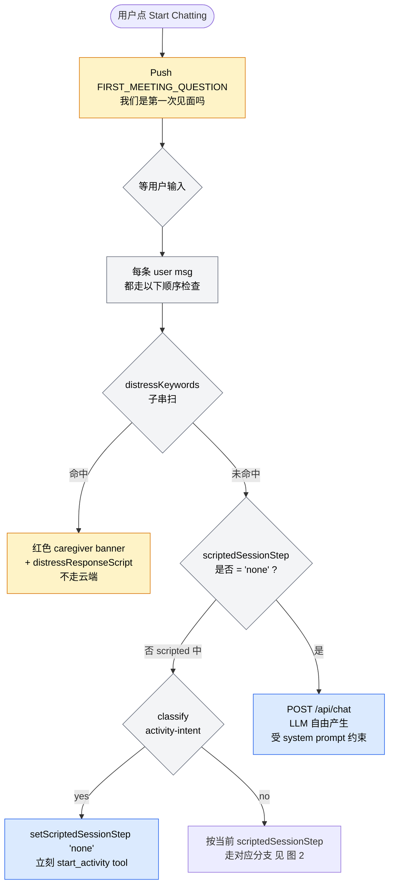
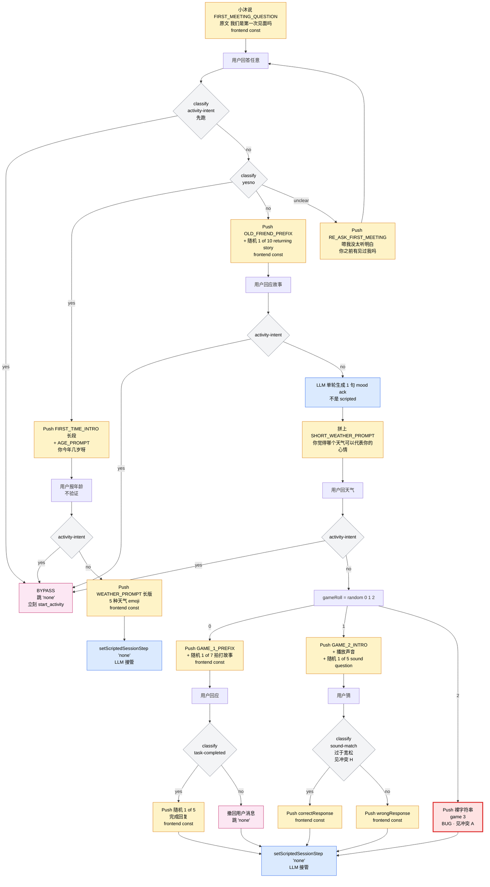
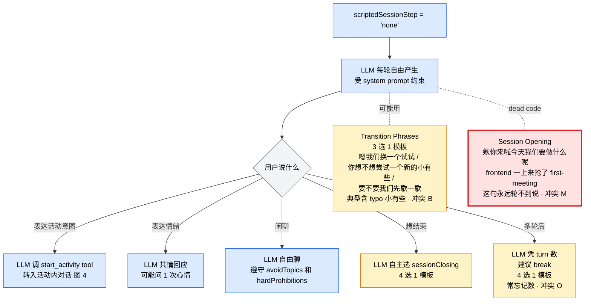
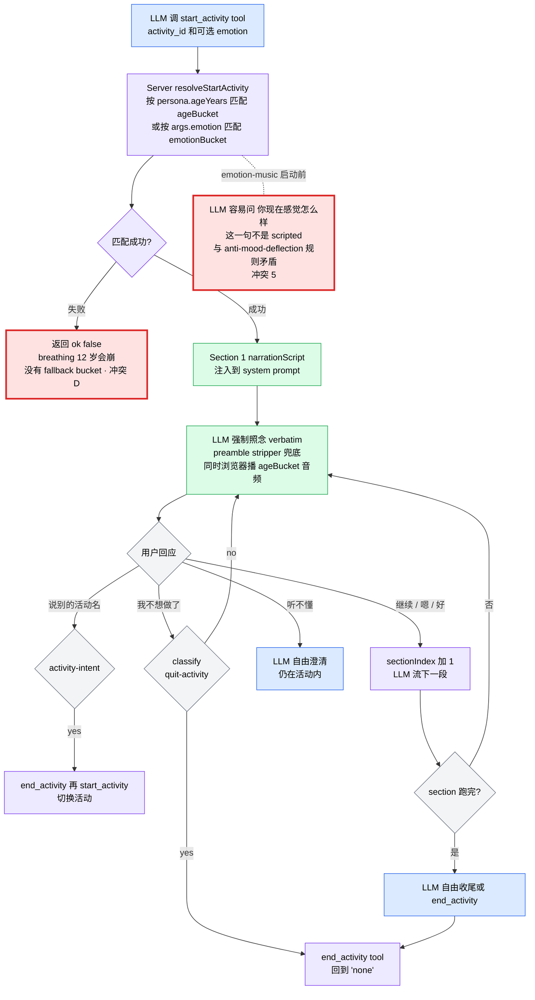
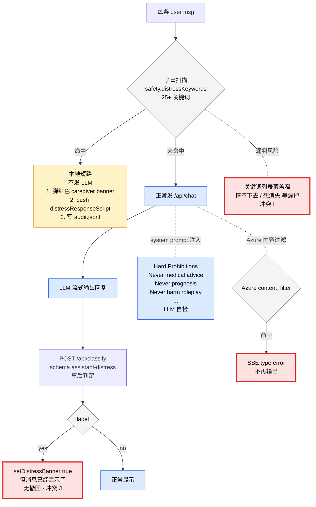
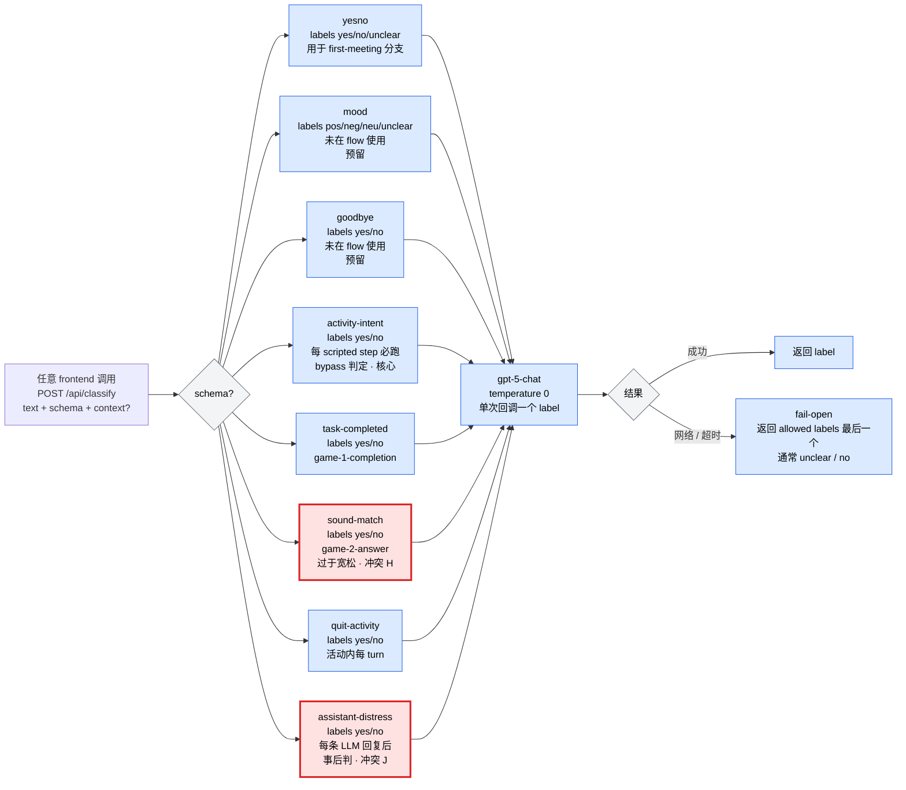

# Xiaomu 对话流 — 纯 Flowchart 版

> 配套 `DIALOGUE_FLOW.md` 文字版。所有冲突 / bug 直接标红在图上。
> 颜色图例：
> - 🟡 **黄色** = Frontend 写死台词（孩子一定会看到这一字不差的句子）
> - 🔵 **蓝色** = LLM 自由产生（受 system prompt 约束）
> - 🟢 **绿色** = LLM 强制照念 verbatim（system prompt 锁定原文）
> - 🟣 **紫色** = Server 注入 speakText（co-creation tool result）
> - 🔴 **红色** = 冲突 / bug（详见 §6）
> - ⚪ **灰色** = Classifier 决策点

---

## 图 1 · 顶层入口与对话来源

---

## 图 2 · Scripted Intro 完整对话树

> **图中冲突标记**：
> - `BUG1` 红框 → 冲突 A (gameRoll=2 显示字面 "game 3")
> - `CSND` 灰框文字含 "过于宽松" → 冲突 H (sound-match classifier 太松)
> - `BYPASS` 粉色 → bypass 路径，可在任意 step 触发
> - 注意 yes 分支结尾直接 `NONE1`，no 分支结尾要先过热身游戏 → **冲突 F**

---

## 图 3 · 进入 'none' 之后的 LLM 自由对话

---

## 图 4 · 活动内对话（breathing / body-rhythm / emotion-music-mapping）

---

## 图 5 · Co-creation 6 Stage 状态机（最复杂活动）

```mermaid
flowchart TD
  StartCC[LLM 调 start_activity co-creation]
  StartCC --> S1[Stage 1 Opener<br/>server 返回 currentSectionText<br/>LLM 照念<br/>邀请选 Do Re Mi Fa Sol La Ti 三个音]

  S1 --> WaitNotes[等用户选音]
  WaitNotes --> Validate{选了几个合法音?}
  Validate -- 不足 3 --> S2Reask[Stage 2 重问<br/>LLM 重列 6 选项<br/>system prompt 强制]
  S2Reask --> WaitNotes
  Validate -- 等于 3 --> S2Ack[Stage 2 Ack<br/>LLM 照念<br/>选得真好我们来听听<br/>系统强制]

  S2Ack --> ForcePM1[iter 0 强制 tool<br/>play_melody notes variant=original]
  ForcePM1 --> ServerInjA[Server 注入 speakText<br/>narration 衔接句]
  ServerInjA --> PlayOrig[浏览器播 original 旋律 .m4a]

  PlayOrig --> AudEnd1[audio.ended<br/>silent 继续 触发下轮 LLM]
  AudEnd1 --> InferA{server infer<br/>coCreationLastVariant<br/>从历史推断<br/>有 race 风险 · 冲突 N}
  InferA --> S4[Stage 4 Three Magics<br/>LLM 照念 整段魔法介绍<br/>system prompt 锁定]

  S4 --> ForcePM2[iter 0 强制 tool<br/>play_melody notes variant=revised]
  ForcePM2 --> ServerInjB[Server 注入 speakText]
  ServerInjB --> PlayRev[浏览器播 revised 旋律 .m4a]
  PlayRev --> AudEnd2[audio.ended silent 继续]
  AudEnd2 --> S5[Stage 5 Menu<br/>LLM 照念<br/>1 换音符 2 改速度 3 加新音符]

  S5 --> ForcePM3[iter 0 强制 tool<br/>play_melody notes variant=background]
  ForcePM3 --> ServerInjC[Server 注入 speakText]
  ServerInjC --> PlayBg[浏览器播 background 旋律 .m4a]

  S5 -.BUG.- MenuFake[菜单 3 选项是假象<br/>无论选哪个都播同一 background<br/>冲突 C]

  PlayBg --> AudEnd3[audio.ended]
  AudEnd3 --> S6[Stage 6 Closing<br/>LLM 照念 收尾词<br/>system prompt 锁定]
  S6 --> ForceEnd[iter 0 强制 tool<br/>end_activity]
  ForceEnd --> ServerInjD[Server 注入 CO_CREATION_CLOSING_TEXT]
  ServerInjD --> Done[setActiveActivity null<br/>回 'none']

  classDef llm fill:#dbeafe,stroke:#2563eb,color:#000
  classDef verbatim fill:#dcfce7,stroke:#16a34a,color:#000
  classDef server fill:#ede9fe,stroke:#7c3aed,color:#000
  classDef bug fill:#fee2e2,stroke:#dc2626,color:#000,stroke-width:3px
  classDef decision fill:#f3f4f6,stroke:#6b7280,color:#000
  class S1,S2Ack,S2Reask,S4,S5,S6 verbatim
  class ForcePM1,ForcePM2,ForcePM3,ForceEnd,ServerInjA,ServerInjB,ServerInjC,ServerInjD,PlayOrig,PlayRev,PlayBg,Done server
  class StartCC llm
  class MenuFake,InferA bug
  class Validate,WaitNotes,AudEnd1,AudEnd2,AudEnd3 decision
```

---

## 图 6 · Safety / Distress 双路检测

---

## 图 7 · 8 个 Classifier Schema 全景

---

## 图 8 · 全局 Scripted vs LLM 对照（一图看清边界）

```mermaid
flowchart TD
  Conv[一次完整会话]

  Conv --> Phase1[阶段 1 · Scripted Intro<br/>frontend 主导]
  Conv --> Phase2[阶段 2 · 'none' 自由对话<br/>LLM 主导]
  Conv --> Phase3[阶段 3 · 活动内<br/>混合]
  Conv --> Phase4[阶段 4 · Distress 短路<br/>frontend 主导]

  Phase1 --> P1A[FIRST_MEETING_QUESTION ·黄]
  Phase1 --> P1B[FIRST_TIME_INTRO + AGE_PROMPT ·黄]
  Phase1 --> P1C[OLD_FRIEND_PREFIX + 10 选 1 story ·黄]
  Phase1 --> P1D[returning 分支 mood ack ·蓝<br/>少见的 LLM 嵌在 scripted 流]
  Phase1 --> P1E[WEATHER long / short ·黄]
  Phase1 --> P1F[GAME_1 prefix + 7 选 1 + 5 选 1 完成回复 ·黄]
  Phase1 --> P1G[GAME_2 intro + 5 选 1 声音 + 对错回复 ·黄]
  Phase1 --> P1H[game 3 裸字符串 ·红 BUG]

  Phase2 --> P2A[闲聊 / 共情 / 推荐活动 ·蓝]
  Phase2 --> P2B[transition phrases 3 选 1 ·蓝<br/>含 typo 小有些 ·红]
  Phase2 --> P2C[break suggestion 4 选 1 ·蓝<br/>常忘记触发 ·红]
  Phase2 --> P2D[session closing 4 选 1 ·蓝]
  Phase2 --> P2E[session opening dead code ·红]

  Phase3 --> P3A[breathing narrationScript ·绿<br/>LLM 强制照念<br/>12 岁会崩 ·红]
  Phase3 --> P3B[body-rhythm narrationScript ·绿]
  Phase3 --> P3C[emotion-music narrationScript ·绿]
  Phase3 --> P3D[co-creation Stage 1 opener ·绿]
  Phase3 --> P3E[co-creation Stage 2/4/5/6 system prompt 锁定 ·绿]
  Phase3 --> P3F[co-creation play_melody / end_activity speakText ·紫]
  Phase3 --> P3G[Stage 5 菜单交互假象 ·红]

  Phase4 --> P4A[distressResponseScript ·黄]
  Phase4 --> P4B[caregiver banner ·黄]
  Phase4 --> P4C[关键词漏判风险 ·红]

  classDef script fill:#fef3c7,stroke:#d97706,color:#000
  classDef llm fill:#dbeafe,stroke:#2563eb,color:#000
  classDef verbatim fill:#dcfce7,stroke:#16a34a,color:#000
  classDef server fill:#ede9fe,stroke:#7c3aed,color:#000
  classDef bug fill:#fee2e2,stroke:#dc2626,color:#000,stroke-width:3px
  classDef phase fill:#fff,stroke:#000,stroke-width:2px
  class Conv,Phase1,Phase2,Phase3,Phase4 phase
  class P1A,P1B,P1C,P1E,P1F,P1G,P4A,P4B script
  class P1D,P2A,P2B,P2C,P2D llm
  class P3A,P3B,P3C,P3D,P3E verbatim
  class P3F server
  class P1H,P2E,P3G,P4C,P2B bug
```

---

## 图 9 · 16 个冲突的依赖关系图

```mermaid
flowchart TD
  Root[16 个冲突]

  Root --> Sev1[🔴 严重 4 个<br/>用户立刻看到]
  Root --> Sev2[🟡 中等 6 个<br/>体验混乱]
  Root --> Sev3[🟢 低 6 个<br/>代码清洁度]

  Sev1 --> A[A · gameRoll=2 显示 'game 3'<br/>位置 TestChat.tsx:1454<br/>修 删 gameRoll=2 或实现游戏 3]
  Sev1 --> B[B · typo 小有些<br/>位置 default.json transitionPhrases<br/>修 改成 小游戏]
  Sev1 --> C[C · Stage 5 菜单假象<br/>位置 assembleSystemPrompt.ts:348<br/>修 删菜单或拆 3 个 melody]
  Sev1 --> D[D · breathing 12 岁崩<br/>位置 default.json ageBuckets<br/>修 加 8-12 bucket 或 fallback]

  Sev2 --> E[E · frontend LLM 双重 yes/no<br/>system prompt opening flow 是 dead instruction]
  Sev2 --> F[F · yes / no 分支热身游戏不一致<br/>第一次见面跳过游戏]
  Sev2 --> G[G · returning 分支 mood ack 是 LLM<br/>失败会卡 scripted 流]
  Sev2 --> H[H · sound-match 过松<br/>鸟 当作 鸡 也算对]
  Sev2 --> I[I · distress 关键词覆盖窄<br/>变体表达漏判]
  Sev2 --> J[J · assistant-distress 事后判<br/>已显示无法撤回]

  Sev3 --> K[K · 同一文本 3-4 处副本 drift]
  Sev3 --> L[L · system prompt opening 80 行 dead code]
  Sev3 --> M[M · session opening 永远说不到]
  Sev3 --> N[N · co-creation stage 推断 race]
  Sev3 --> O[O · maxTurnsBeforeBreak 靠 LLM 自数]
  Sev3 --> P[P · 年龄字段双源 persona vs 口报]

  Sev1 -.可立刻修复.- Quick[预计 1 小时内全部修完]
  Sev2 -.需要决策.- Design[需要产品设计判断<br/>例 sound-match 多宽松算合理]
  Sev3 -.可延后.- Tech[纯技术债]

  classDef sev1 fill:#fee2e2,stroke:#dc2626,color:#000,stroke-width:3px
  classDef sev2 fill:#fef3c7,stroke:#d97706,color:#000
  classDef sev3 fill:#dcfce7,stroke:#16a34a,color:#000
  classDef meta fill:#fff,stroke:#000
  class Sev1,A,B,C,D sev1
  class Sev2,E,F,G,H,I,J sev2
  class Sev3,K,L,M,N,O,P sev3
  class Root,Quick,Design,Tech meta
```

---

## 速查 · 颜色 → 含义 → 改的地方

| 颜色   | 含义               | 改它要去哪改                                                                                           |
| ---- | ---------------- | ------------------------------------------------------------------------------------------------ |
| 🟡 黄 | Frontend 写死      | `apps/studio/src/panels/ConversationFlow.tsx` 或 `data/configs/default.json` 的 `conversationFlow` |
| 🟢 绿 | LLM 强制照念         | `data/configs/default.json` 各 activity 的 `narrationScript`                                       |
| 🔵 蓝 | LLM 自由           | `data/configs/default.json` 的 `personality` / `voiceSamples` 影响风格；`safety` 加约束                   |
| 🟣 紫 | Server speakText | `apps/server/src/lib/coCreationAudio.ts` (写死)                                                    |
| 🔴 红 | 冲突 / bug         | 见 §6 冲突清单 (DIALOGUE_FLOW.md)                                                                     |
| ⚪ 灰  | Classifier       | `apps/server/src/routes/classify.ts` 改 instruction 与 labels                                      |
