# Xiaomu Studio — 完整流程图 (Full System Flowchart)

> 涵盖所有决策点、所有可能的响应类型、所有失败路径。
> 所有图表使用 Mermaid 语法 (在 VS Code / GitHub / Obsidian 中直接渲染)。
> 文件路径与行号引用自当前 `main` 分支代码。

---

## 目录

1. [顶层架构 (Top-Level Architecture)](#1-顶层架构)
2. [Chat 请求完整生命周期](#2-chat-请求完整生命周期)
3. [TestChat 前端 scripted intro 状态机](#3-testchat-前端-scripted-intro-状态机)
4. [System Prompt 组装流程](#4-system-prompt-组装流程)
5. [Tool Call 解析与强制 (start_activity / play_melody / end_activity)](#5-tool-call-解析与强制)
6. [Co-creation 6 阶段状态机](#6-co-creation-6-阶段状态机)
7. [Scripted Activity (breathing / body-rhythm / emotion-music-mapping) 流程](#7-scripted-activity-流程)
8. [TTS Pipeline (sanitizer → SSML → Azure Speech → audio + visemes)](#8-tts-pipeline)
9. [Voice Live Pipeline (WS bridge)](#9-voice-live-pipeline)
10. [Face Renderer Pipeline (3 streams)](#10-face-renderer-pipeline)
11. [Safety / Distress 检测全流程](#11-safety--distress-检测全流程)
12. [Audio 播放与队列调度](#12-audio-播放与队列调度)
13. [Classify (`/api/classify`) 决策表](#13-classify-决策表)
14. [所有可能的 SSE 事件类型 (Response Type Matrix)](#14-sse-事件类型矩阵)
15. [所有可能的错误响应](#15-所有可能的错误响应)
16. [Publish / Export 流程 (未来)](#16-publish--export-流程)

---

## 1. 顶层架构

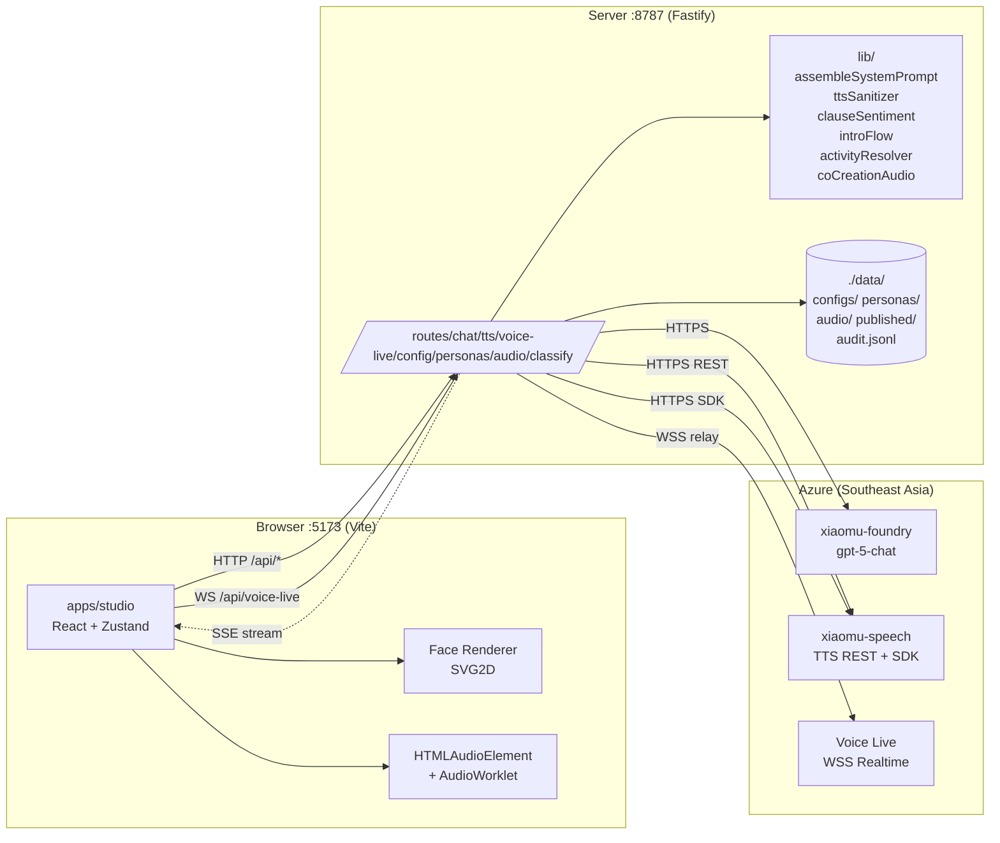

---

## 2. Chat 请求完整生命周期

`POST /api/chat` — `apps/server/src/routes/chat.ts:368-722`

```mermaid
graph TD
  Start([User 在 TestChat 输入文本<br/>或 scripted step 自动触发])

  Start --> LocalSafety{本地 distressKeywords<br/>子串匹配?<br/>Safety.distressKeywords}
  LocalSafety -- 命中 --> DistressShort[弹 distressBanner<br/>发 distressResponseScript<br/>不调用云端<br/>写 audit.jsonl]
  DistressShort --> End1([结束本轮])

  LocalSafety -- 未命中 --> ScriptedCheck{当前 scriptedSessionStep<br/>是否 = 'none' ?}

  ScriptedCheck -- 否 --> ScriptedFlow[进入 TestChat scripted 分支<br/>见 §3]
  ScriptedFlow --> End2([见 §3 终态])

  ScriptedCheck -- 是 --> Post[POST /api/chat<br/>configId, personaId,<br/>messages, activityContext?]

  Post --> Validate{ChatBodySchema<br/>safeParse}
  Validate -- fail --> R400[HTTP 400<br/>error, details]
  Validate -- ok --> LoadCfg{Load config<br/>+ persona<br/>readJson}
  LoadCfg -- 任一为 null --> R404[HTTP 404]

  LoadCfg -- ok --> CoCreate{activityId === 'co-creation' ?}
  CoCreate -- 是 --> InferStage[inferCoCreationVariant<br/>从历史消息推断 stage<br/>取 max studio vs server<br/>chat.ts:190-206]
  CoCreate -- 否 --> SkipCC
  InferStage --> SkipCC[Assemble System Prompt<br/>详见 §4]

  SkipCC --> Temp{activityContext.therapyMode ?}
  Temp -- 是 --> TLow[temp = personality.therapyTemperature ~0.6]
  Temp -- 否 --> THigh[temp = personality.defaultTemperature ~0.85]

  TLow --> Tools
  THigh --> Tools[选择本轮 tools<br/>start_activity: 仅当无激活活动<br/>play_melody / end_activity: 仅 co-creation]

  Tools --> Force{iter == 0 且<br/>co-creation 状态?}
  Force -- ccVariant=none --> F1[强制 play_melody<br/>stage 2]
  Force -- ccVariant=original --> F2[强制 play_melody<br/>stage 4]
  Force -- ccVariant=revised --> F3[强制 play_melody<br/>stage 5]
  Force -- ccVariant=background --> F4[强制 end_activity<br/>stage 6]
  Force -- 其他 --> Auto[tool_choice = 'auto']

  F1 --> Hijack
  F2 --> Hijack
  F3 --> Hijack
  F4 --> Hijack
  Auto --> Hijack[reply.hijack 启动 SSE<br/>Content-Type: text/event-stream]

  Hijack --> LoopStart[[ITER 循环 0..3<br/>MAX_TOOL_ITERATIONS=4]]

  LoopStart --> Stream[client.chat.completions.create stream:true]

  Stream --> ChunkLoop{每个 delta chunk}

  ChunkLoop -- text delta --> Iter0Held{iter==0 且本轮有 tool?}
  Iter0Held -- 是 --> Buffer[暂存到 iter0HeldText<br/>不立即推给前端]
  Iter0Held -- 否 --> ScriptStrip{有 currentSectionText<br/>preamble 待对齐?}
  ScriptStrip -- 是 --> Align[缓冲直到首 8 字符<br/>与 section 起始对齐<br/>或 200 字符超时全部 flush]
  ScriptStrip -- 否 --> Emit
  Align --> Emit
  Buffer --> NextChunk
  Emit[emitText:<br/>1. 累加 assistantContent<br/>2. SSE type=text delta=chunk<br/>3. clauseSentiment.feed chunk<br/>4. 若发出 ExpressionEvent → SSE type=expression]

  ChunkLoop -- tool_calls delta --> AccumTool[按 index 累加 ToolCallAccum<br/>id, name, argsBuf 拼接]

  ChunkLoop -- usage --> Usage[记录 prompt/completion tokens]

  ChunkLoop -- finish_reason --> CheckFinish{finish_reason}
  CheckFinish -- stop --> ResolveDone[无 tool_calls<br/>跳出循环]
  CheckFinish -- tool_calls --> ResolveTools[解析 tool calls<br/>见 §5]
  CheckFinish -- length --> Done
  CheckFinish -- content_filter --> SafetyEmit[SSE type=error<br/>safety 触发]

  ResolveTools --> ToolDispatch{which tool}
  ToolDispatch -- start_activity --> RSA[resolveStartActivity<br/>见 §5]
  ToolDispatch -- play_melody --> RPM[resolvePlayMelody<br/>findCoCreationAudio]
  ToolDispatch -- end_activity --> REA[end_activity<br/>co-creation 返回 closing speakText]

  RSA --> EmitTool
  RPM --> EmitTool
  REA --> EmitTool[SSE type=tool_call<br/>name, args, result]

  EmitTool --> ServerNarr{result.speakText 存在?<br/>play_melody / end_activity}
  ServerNarr -- 是 --> Narrate[服务器自己说<br/>SSE type=text delta=speakText<br/>feed classifier<br/>serverHandledThisTurn=true]
  ServerNarr -- 否 --> NoNarr
  Narrate --> AppendTool
  NoNarr --> AppendTool[push role=tool messages<br/>带 tool_call_id 与 result JSON]

  AppendTool --> CheckBreak{serverHandledThisTurn ?}
  CheckBreak -- 是 --> ForceBreak[finishReason='stop'<br/>flush classifier<br/>break iter loop]
  CheckBreak -- 否 --> LoopCond{iter < 4 且<br/>finishReason=='tool_calls' ?}
  LoopCond -- 是 --> LoopStart
  LoopCond -- 否 --> ResolveDone

  ResolveDone --> FlushClass[flush 余留 classifier 事件]
  ForceBreak --> FlushClass
  FlushClass --> EmitDone[SSE type=done<br/>usage tokens]
  EmitDone --> RawEnd([raw.end])

  NextChunk -.-> ChunkLoop

  classDef err fill:#fee2e2,stroke:#dc2626
  classDef ok fill:#dcfce7,stroke:#16a34a
  classDef safety fill:#fef3c7,stroke:#d97706
  class R400,R404,SafetyEmit err
  class RawEnd ok
  class LocalSafety,DistressShort,SafetyEmit safety
```

---

## 3. TestChat 前端 scripted intro 状态机

`apps/studio/src/panels/TestChat.tsx` — 处理首次见面、热身游戏、活动启动前的所有 scripted 对话。

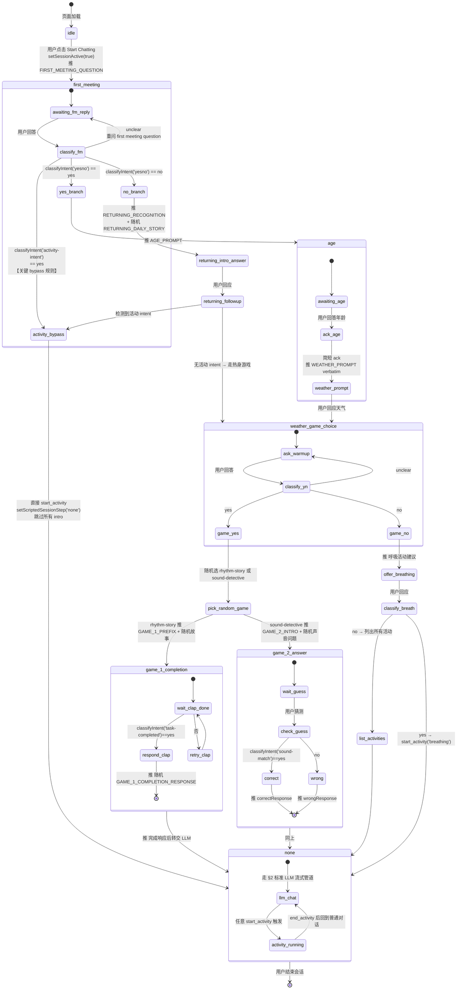

> **关键规则 (memory: project_intent_bypass)**:
> 任意 step 下，只要 `classifyIntent('activity-intent') == yes`，立刻 `setScriptedSessionStep('none')` 并调 `start_activity`，跳过剩余 intro。此规则必须在每次重构后保留。

---

## 4. System Prompt 组装流程

`apps/server/src/lib/assembleSystemPrompt.ts:59-429` — 决定性函数 (snapshot-tested)。

```mermaid
graph TD
  In([assembleSystemPrompt<br/>config, persona, activityContext?])

  In --> S1[1. Identity<br/>robot name, tagline,<br/>primary/secondary language]
  S1 --> S2[2. Character<br/>traits, do-list, don't-list]
  S2 --> S3[3. Child Profile<br/>name, age, backstory,<br/>communicationAbility,<br/>mobility, sensoryProfile,<br/>likes, dislikes,<br/>musicPreferences]
  S3 --> S4{4. Language Register<br/>match persona.ageYears<br/>against ageRouting buckets}

  S4 --> S4A[very-simple<br/>1–5 词句]
  S4 --> S4B[simple<br/>短句, 具体名词]
  S4 --> S4C[normal<br/>自然口语]
  S4 --> S4D[nuanced<br/>可用比喻/情绪词]

  S4A --> S5
  S4B --> S5
  S4C --> S5
  S4D --> S5[5. Voice Guide<br/>嵌入全部 voiceSamples<br/>按 category 标注]

  S5 --> S6[6. Safety<br/>avoidTopics<br/>hardProhibitions]

  S6 --> SafetyOpening{activityContext 不存在?<br/>即活动未在跑}
  SafetyOpening -- 是 --> OpeningFlow[内联 Opening Flow:<br/>FIRST-MEETING-QUESTION<br/>↳ YES → FIRST-TIME-INTRO + AGE-PROMPT + WEATHER-PROMPT, 停<br/>↳ NO → RETURNING-RECOGNITION + 随机故事 → 活动决策<br/>活动决策:<br/>A. 直接 intent → start_activity 立即调<br/>B. 模糊 → 热身游戏 offer<br/>  B.1 YES → rhythm-story 或 sound-detective<br/>  B.2 NO → 呼吸 → 列活动<br/>C. 任何时候 override<br/>+ rhythm-story 全部故事内联<br/>+ sound-detective 全部声音内联]
  SafetyOpening -- 否 --> S7

  OpeningFlow --> S7{7. Activities<br/>未激活时}
  S7 -- 未激活 --> S7Body[列出所有活动 + tool 描述<br/>+ 意图识别铁律:<br/>判语义不判关键词<br/>明确 → 立即 start_activity 不再问<br/>模糊 → 仅一句 你想做什么呢<br/>禁止 mood 比喻 deflection<br/>禁止活动前问情绪]
  S7 -- 已激活 --> S8

  S7Body --> S8{8. Activity Context<br/>activityContext 存在?}

  S8 -- co-creation interactive --> S8CC[Stage 索引<br/>2 / 4 / 5 / 6<br/>来自 coCreationLastVariant<br/>只输出当前 stage<br/>Stage 2: 收 3 音 → play_melody original<br/>Stage 4: three-magics → play_melody revised<br/>Stage 5: menu → play_melody background<br/>Stage 6: 收尾 → end_activity<br/>+ 完整对话指南]
  S8 -- scripted age-bucketed --> S8AB[当前 section 文本逐字注入<br/>规则: 无 preamble<br/>逐字读 stop after section<br/>不预告下一段]
  S8 -- scripted emotion-bucketed --> S8EB[同上 emotion bucket]
  S8 -- 无 --> S9

  S8CC --> S9
  S8AB --> S9
  S8EB --> S9[9. Session Rhythm<br/>sessionOpeningScript<br/>sessionClosingScript ('/' 选项)<br/>transitionPhrases<br/>maxTurnsBeforeBreak]

  S9 --> Out([systemPrompt string])
```

---

## 5. Tool Call 解析与强制

```mermaid
graph LR
  subgraph ToolForce["Iteration 0 工具强制 (chat.ts:444-461)"]
    direction TB
    CC{ccVariant?}
    CC -- none --> F_PM_O[force play_melody<br/>stage 2]
    CC -- original --> F_PM_R[force play_melody<br/>stage 4]
    CC -- revised --> F_PM_B[force play_melody<br/>stage 5]
    CC -- background --> F_EA[force end_activity<br/>stage 6]
    CC -- 非 co-creation --> AUTO[tool_choice='auto']
  end

  subgraph SA["resolveStartActivity (chat.ts:262-350)"]
    direction TB
    SA_In([args: activityId])
    SA_In --> SA_Lookup{lookup activity<br/>in config.activities}
    SA_Lookup -- 不存在 --> SA_Fail[ok:false<br/>error: activity not found]
    SA_Lookup -- 存在 --> SA_Type{activity.type?}
    SA_Type -- interactive co-creation --> SA_CC[ok:true<br/>interactive:true<br/>currentSectionText: stage1 opener<br/>speakingInstruction<br/>activityId]
    SA_Type -- scripted age-bucketed --> SA_Age[match persona.ageYears<br/>到 ageBuckets]
    SA_Age -- 匹配 --> SA_AgeOK[ok:true<br/>audioPlaylist: bucket.audioFilenames<br/>currentSectionText: section 1<br/>sectionNumber:1, totalSections:N<br/>matchedBucket<br/>speakingInstruction]
    SA_Age -- 无匹配 --> SA_Fail
    SA_Type -- scripted emotion --> SA_Emo[match args.emotion<br/>到 emotionBuckets]
    SA_Emo -- 匹配 --> SA_AgeOK
    SA_Emo -- 无匹配 --> SA_Fail
  end

  subgraph PM["resolvePlayMelody (chat.ts:208-260)"]
    direction TB
    PM_In([args: notes[], variant?])
    PM_In --> PM_Override[服务器覆盖:<br/>variant ← expectedVariant 由 stage<br/>notes ← pinnedNotes 由 stage 2 已收集]
    PM_Override --> PM_Find{findCoCreationAudio<br/>notes + variant<br/>→ audioMapping}
    PM_Find -- 找到 --> PM_OK[ok:true<br/>notes, variant, filename,<br/>playCount: 1 or 2,<br/>speakText: 阶段 narration,<br/>speakingInstruction]
    PM_Find -- 未找到 --> PM_Fail[ok:false<br/>error: no audio for notes/variant]
  end

  subgraph EA["end_activity"]
    direction TB
    EA_In([args]) --> EA_Type{当前活动?}
    EA_Type -- co-creation --> EA_CC[ok:true<br/>speakText: CO_CREATION_CLOSING_TEXT]
    EA_Type -- 其他 --> EA_Plain[ok:true]
  end

  ToolForce --> SA
  ToolForce --> PM
  ToolForce --> EA
```

---

## 6. Co-creation 6 阶段状态机

四个 LLM 可见的阶段 (Stage 2, 4, 5, 6) + 两个 server-only 衔接 (Stage 1, 3).

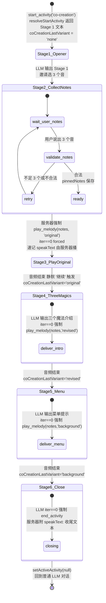

> Stage 推断 `inferCoCreationVariant` (chat.ts:190-206) 从历史 assistant 消息末→首扫描 canonical markers，取 `max(studio.coCreationLastVariant, inferred)` 避免 React batching race。

---

## 7. Scripted Activity 流程

适用于 `breathing` / `body-rhythm` / `emotion-music-mapping`。

```mermaid
graph TD
  Start([LLM call start_activity activityId])

  Start --> RSA[resolveStartActivity]
  RSA --> Type{activity.type}

  Type -- age-bucketed<br/>breathing / body-rhythm --> Match[match persona.ageYears<br/>→ ageBuckets bucket]
  Type -- emotion-bucketed<br/>emotion-music-mapping --> EmoMatch[match args.emotion<br/>→ emotionBuckets bucket]

  Match --> Build
  EmoMatch --> Build[Build playlist:<br/>bucket.audioFilenames<br/>sectionNumber=1<br/>totalSections=N]

  Build --> StoreState[Client:<br/>setActiveActivity<br/>setActivityPlaylist index:0<br/>setActivitySectionIndex 0]

  StoreState --> EmotionTimer{type == emotion-mapping?}
  EmotionTimer -- 是 --> StartTimer[startEmotionMappingTimer<br/>20s window<br/>1.5s fade]
  EmotionTimer -- 否 --> NoTimer
  StartTimer --> StreamSec
  NoTimer --> StreamSec[LLM 流式 section 文本<br/>preamble stripper 对齐<br/>or 200char timeout]

  StreamSec --> Speak[TTS section 文本<br/>→ 音频播放]
  Speak --> PlayMusic[同时:<br/>audioPlaylist 当前 file 播]

  PlayMusic --> AudioEnded{audio.ended?}
  AudioEnded -- age-bucketed --> Loop[index = (index+1) % playlist.length<br/>循环播放]
  AudioEnded -- emotion-mapping --> TimerWait[等 20s timer<br/>fade out 后切下一 section]
  AudioEnded -- co-creation --> CCPlay{playCount > 1 ?}
  CCPlay -- 是 --> Replay[同曲再播一次<br/>playCount--]
  CCPlay -- 否 --> SilentContinue[silent 继续 触发 LLM 下一段]

  Loop --> WaitUser
  TimerWait --> AdvSec
  SilentContinue --> NextLLM

  WaitUser([等用户消息 e.g. 继续]) --> AdvSec[sectionIndex += 1<br/>下一次 chat 请求带新 sectionIndex]
  AdvSec --> AllDone{sectionIndex >= totalSections?}
  AllDone -- 否 --> StreamSec
  AllDone -- 是 --> Wrap[LLM 收尾 closingScript]
  Wrap --> EndAct[end_activity 自动或 LLM 触发<br/>setActiveActivity null<br/>setActivityPlaylist null<br/>cancel timers]
  EndAct --> Out([回到普通对话])

  NextLLM --> Wrap
```

---

## 8. TTS Pipeline

`POST /api/tts` 与 `POST /api/tts/visemes` — `apps/server/src/routes/tts.ts` + `apps/server/src/lib/ttsSanitizer.ts:88-216`

```mermaid
graph TD
  In([POST /api/tts text, voice?, style?, rate?, pitch?])

  In --> Resolve[Resolve:<br/>voice = body.voice OR env DEFAULT_VOICE OR zh-CN-XiaoxiaoMultilingualNeural<br/>style = body.style OR env DEFAULT_STYLE OR cheerful<br/>lang = zh-CN]

  Resolve --> San[sanitize 决定性管道]

  subgraph Sanitizer["ttsSanitizer 顺序固定"]
    direction TB
    St1[1. 去 code fences 三反引号]
    St1 --> St2[2. 配对引号<br/>「」 『』 « » ' ' 等<br/>→ wrap emphasis level=moderate]
    St2 --> St3[3. 移除剩余孤立引号<br/>仅文本段]
    St3 --> St4[4. 移除 inline markdown<br/>bold italic code _ * 反引号]
    St4 --> St5{5. expandEmoji?}
    St5 -- 是 --> St5Y[替换为普通话标签]
    St5 -- 否 --> St5N[移除 emoji]
    St5Y --> St6
    St5N --> St6[6. 文本段 between SSML tags:<br/>XML-escape & < ><br/>数字 → say-as cardinal<br/>普通话标点后 break time=100ms]
    St6 --> St7{7. rate/pitch ?}
    St7 -- 任一存在 --> St7Y[wrap prosody]
    St7 -- 否 --> St7N
    St7Y --> St8
    St7N --> St8[8. 外包<br/>speak voice mstts:express-as style]
  end

  San --> Sanitizer
  Sanitizer --> SSML([valid SSML string])

  SSML --> Branch{endpoint?}

  Branch -- /api/tts REST 流 --> REST[POST Azure TTS REST<br/>cognitiveservices/v1<br/>Format: audio-24khz-48kbitrate-mono-mp3<br/>Header: Ocp-Apim-Subscription-Key]

  REST --> RestResp{response status}
  RestResp -- fetch err --> R502a[HTTP 502<br/>TTS fetch failed]
  RestResp -- !ok --> R502b[HTTP 502<br/>TTS service error<br/>status, details]
  RestResp -- empty body --> R502c[HTTP 502<br/>TTS returned empty body]
  RestResp -- ok --> Pipe[hijack raw<br/>Content-Type: audio/mpeg<br/>pipe ttsResponse.body<br/>raw.end]
  Pipe --> Out1([MP3 audio stream → 浏览器 Audio])

  Branch -- /api/tts/visemes SDK --> SDK[SpeechSDK:<br/>AudioOutputStream.createPullStream<br/>AudioConfig.fromStreamOutput<br/>SpeechSynthesizer]
  SDK --> Synth[speakSsmlAsync ssml]
  SDK --> Capture[visemeReceived event<br/>push audioOffsetMs, visemeId]

  Synth --> Drain[读 pullStream 16KB chunks<br/>concat Buffer]
  Synth --> SynthFail{synth fail?}
  SynthFail -- 是 --> R502d[HTTP 502<br/>TTS viseme synthesis failed]
  SynthFail -- 否 --> Drain

  Drain --> Encode[base64 encode audio]
  Encode --> Sort[sort visemes by offset]
  Sort --> Out2([JSON: audio base64, visemes[], ssml])

  classDef err fill:#fee2e2,stroke:#dc2626
  class R502a,R502b,R502c,R502d err
```

---

## 9. Voice Live Pipeline

WebSocket `apps/server/src/routes/voice-live.ts:24-191`

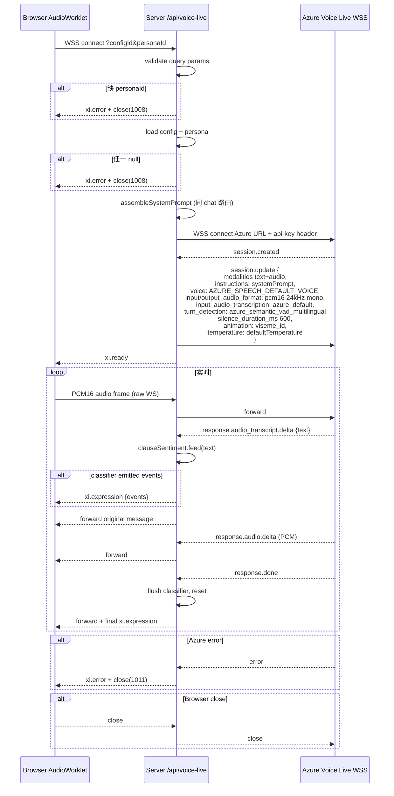

---

## 10. Face Renderer Pipeline

三条独立流在 SVG 上汇合。

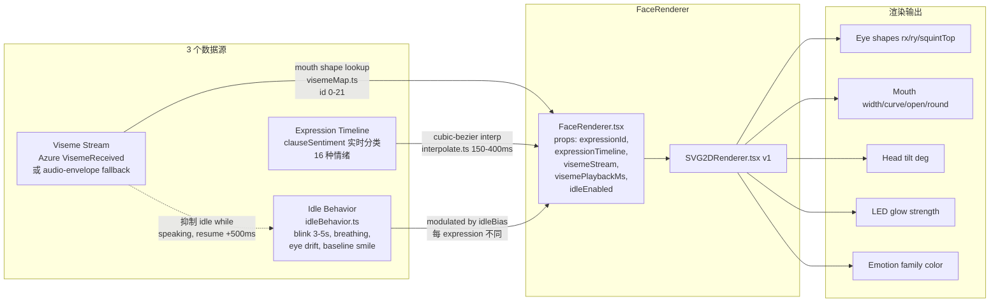

### 16 个表情 → 颜色/形态

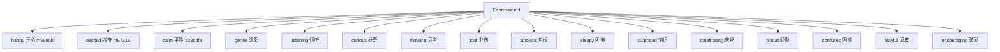

---

## 11. Safety / Distress 检测全流程

两条独立的检测路径，任一触发都会显示 caregiver banner。

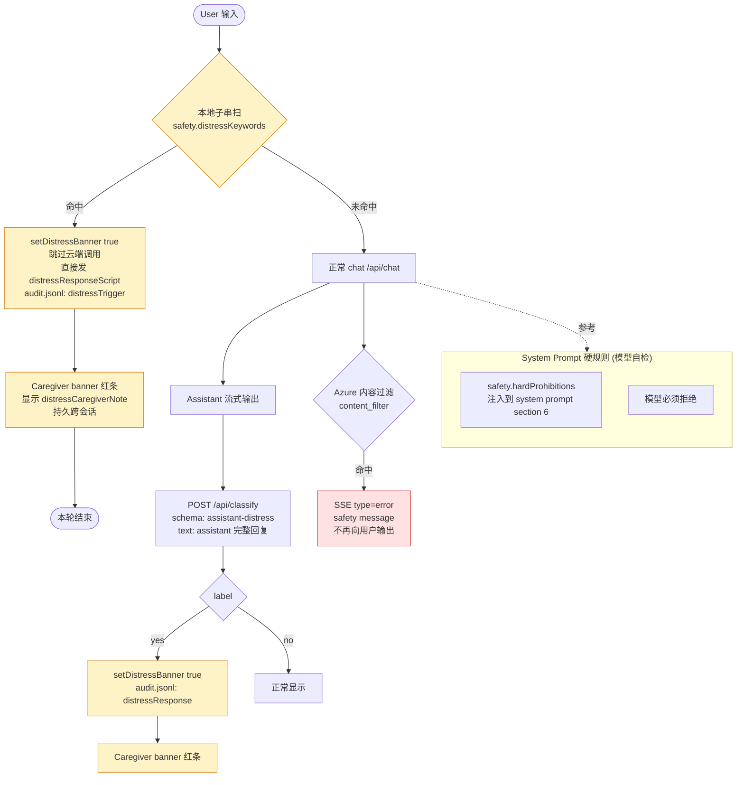

### Safety Panel 字段 → 影响点对照

| 字段 | 影响位置 | 行为 |
|---|---|---|
| `avoidTopics` | systemPrompt §6 | 软引导 — 模型尽量避开 |
| `hardProhibitions` | systemPrompt §6 | 硬约束 — 模型必须拒绝 |
| `distressKeywords` | TestChat 客户端 | 本地子串短路，绝不上云 |
| `distressCaregiverNote` | 红色 banner | 用户可见的看护人提示 |
| `assistantDistressMarkers` | `/api/classify` schema | 模型回复后二次判定 |
| `distressResponseScript` | 本地短路回复 | 命中关键词时直接说的句子 |

---

## 12. Audio 播放与队列调度

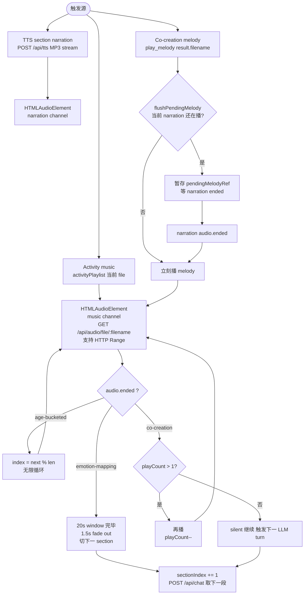

---

## 13. Classify 决策表

`POST /api/classify` — `apps/server/src/routes/classify.ts:131-164`
统一一个调 gpt-5-chat 的轻量分类端点，多个 schema 共用。

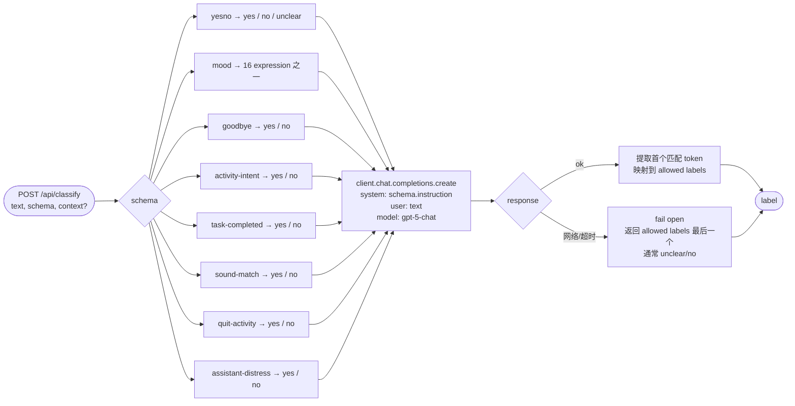

### 各 schema 用途
| schema | 调用位置 | 用途 |
|---|---|---|
| `yesno` | TestChat first-meeting / warmup choice / breathing offer | 二元决策 |
| `mood` | 未来 emotion routing | 用户情绪 → 表情/活动映射 |
| `goodbye` | TestChat 会话末端 | 是否触发 sessionClosingScript |
| `activity-intent` | TestChat **每条用户消息** | 直接活动 bypass (核心规则) |
| `task-completed` | TestChat rhythm-story step | 用户是否拍完 |
| `sound-match` | TestChat sound-detective step | 猜对了吗 |
| `quit-activity` | 活动中每条用户消息 | 用户是否想退出当前活动 |
| `assistant-distress` | 助手回复后 | 二次判定模型有没有说危险话 |

---

## 14. SSE 事件类型矩阵

`/api/chat` 通过 `text/event-stream` 推回前端的全部事件:

```mermaid
graph LR
  SSE([SSE Event Types])

  SSE --> T1[type: text<br/>delta: chunk<br/>每个 token/clause]
  SSE --> T2[type: expression<br/>timeline: ExpressionCue[]<br/>clauseSentiment 输出]
  SSE --> T3[type: tool_call<br/>name, args, result<br/>start_activity / play_melody / end_activity]
  SSE --> T4[type: done<br/>usage promptTokens, completionTokens]
  SSE --> T5[type: error<br/>message<br/>流中任意错误]
```

### 每种 type 的可能 payload

| Type | 字段 | 触发条件 | 可能值 |
|---|---|---|---|
| `text` | `delta: string` | 每个 LLM chunk / server-narrated speakText | 任意 Mandarin/English 文本 |
| `expression` | `timeline: { atCharOffset, expressionId, confidence }[]` | clauseSentiment 在标点处发出 | expressionId ∈ 16 种; confidence 0-1 |
| `tool_call` | `name, args, result` | 模型调工具且服务器解析后 | name ∈ {start_activity, play_melody, end_activity}; result 见 §5 |
| `done` | `usage: { promptTokens, completionTokens }` | 流自然结束 | 整数 |
| `error` | `message: string` | 任意 stream/Azure 错误 | "azure foundry timeout" / "content_filter" / etc. |

---

## 15. 所有可能的错误响应

```mermaid
graph TD
  ERR([Error Surfaces])

  ERR --> HTTP[HTTP 错误]
  HTTP --> H400[400<br/>request schema 验证失败<br/>所有 /api/* PUT/POST]
  HTTP --> H404[404<br/>config / persona / audio 文件不存在]
  HTTP --> H502[502<br/>下游 Azure 失败<br/>/api/tts /api/tts/visemes]
  HTTP --> H500[500<br/>未捕获异常<br/>Fastify 默认]

  ERR --> SSEEv[SSE 流内事件]
  SSEEv --> SE1[type=error<br/>foundry 流断]
  SSEEv --> SE2[type=error<br/>content_filter 触发]
  SSEEv --> SE3[type=error<br/>tool resolve 异常]

  ERR --> WS[WebSocket close codes]
  WS --> W1[1008 policy<br/>缺 personaId / config 不存在]
  WS --> W2[1011 internal<br/>Azure WS 错或浏览器异常]
  WS --> W3[1000 normal<br/>Azure 主动关]

  ERR --> Client[前端兜底]
  Client --> C1[ttsSanitizer 失败<br/>无 pre-check<br/>会以 502 形式从 /api/tts 返回]
  Client --> C2[Classify fail-open<br/>返回 allowed labels 最后一个<br/>用户感知不到]
  Client --> C3[viseme 失效<br/>fallback to audio-envelope<br/>面孔仍能动]
  Client --> C4[Audio 文件 404<br/>activity 直接跳过该 section<br/>不阻塞流]
  Client --> C5[Distress 命中<br/>云端短路<br/>caregiver banner 显示]

  classDef bad fill:#fee2e2,stroke:#dc2626
  class H400,H404,H502,H500,SE1,SE2,SE3,W1,W2 bad
```

---

## 16. Publish / Export 流程

> v1 中已脱离 critical path — `data/published/` 目录留好，端点未完整实现。

```mermaid
graph LR
  PB([User 点 Publish])
  PB --> Snap[读当前 config + persona + audio manifest]
  Snap --> Hash[每个 audio 文件计算 sha256]
  Hash --> Bundle[组装 StudioBundle v1<br/>schemaVersion: 1<br/>version: N<br/>publishedAt: ISO<br/>publishedBy: git email<br/>config + audioManifest]
  Bundle --> Write[写 data/published/v{N}.json]
  Write --> Audit[append data/audit.jsonl<br/>publishEvent]

  EX([User 点 Export]) --> Zip[打包 StudioBundle.zip<br/>config JSON + audio files + manifest]
  Zip --> Down[浏览器下载]
```

---

## 附录 A — Zustand Store Slices 与对应面板

| Slice | 数据 | 写入面板 | 读取者 |
|---|---|---|---|
| `config` | StudioConfig | 所有 panel | 全部 |
| `personas[]` | Persona[] | Personas | TestChat (选择), system prompt |
| `audioFiles[]` | AudioFileEntry[] | AudioLibrary | Activities (绑定 filename), TestChat (播放) |
| `transcript[]` | Message[] | — | TestChat |
| `sessionActive` | boolean | TestChat Start | TestChat |
| `scriptedSessionStep` | enum | TestChat | TestChat |
| `activeActivity` | { id, type, totalSections? } | resolveStartActivity | TestChat (router), Face |
| `activityPlaylist` | { playlist, index, paused } | resolveStartActivity / audio.ended | AudioEl, TestChat |
| `activitySectionIndex` | number | section advance | chat request body |
| `coCreationLastVariant` | 'none'\|'original'\|'revised'\|'background' | play_melody success | chat request body |
| `coCreationNotes` | string[] \| null | stage 2 validate | chat request body (pinnedNotes) |
| `distressBanner` | boolean | local keyword / classify | 全屏红条 |

## 附录 B — 完整端到端示例 (含所有分支命中)

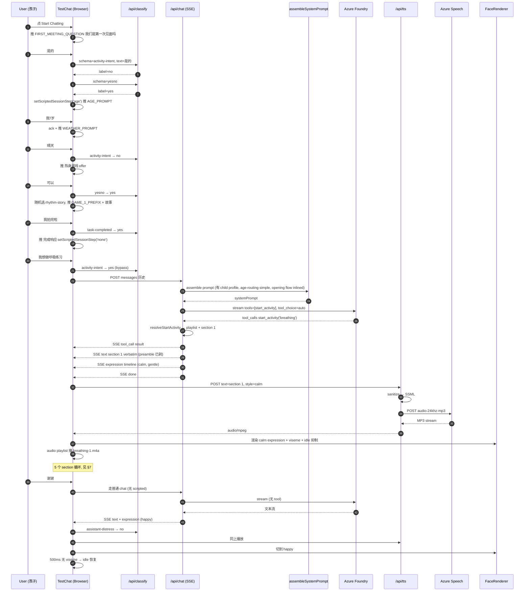

---

> **更新规则**: 此文件随 §2 CLAUDE.md 决策变动时同步更新。任何新增 panel / 新增 SSE 事件 / 新增 classify schema / 新增 activity type / 新增 expression 都应在对应章节增补节点。
